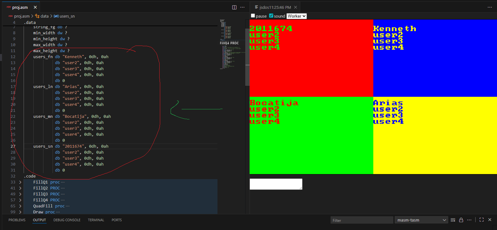

# VGA Quadrant Display Project (proj.asm)

This project displays **four colored quadrants** in VGA Mode 13h (320x200x256) 
and prints text ***(student_number, first_name, middle_name, last_name)*** respectively inside each quadrant using BIOS interrupts.

---

## 🖥 Overview

Each quadrant is rendered using **direct memory access** to video memory (A000h) 
and filled with distinct colors.  
Strings are written using BIOS video services (`INT 10h, AH=09h`) to simulate 
character rendering in a cell-based grid (8x8 pixels per cell).

---

## 🧩 File Description

| File | Description |
|------|--------------|
| `proj.asm` | Main assembly source file |
| `images/`  | Folder for project screenshots or reference images (add your own if you want) |

---

## 🗂 Data Structure

You can edit the following data sections to change the text displayed in each quadrant:

```asm
users_fn db "Kenneth", 0dh, 0ah
         db "user2", 0dh, 0ah
         db "user3", 0dh, 0ah
         db "user4", 0dh, 0ah
         db 0

users_ln db "Arias", 0dh, 0ah
         db "user2", 0dh, 0ah
         db "user3", 0dh, 0ah
         db "user4", 0dh, 0ah
         db 0

users_mn db "Bocatija", 0dh, 0ah
         db "user2", 0dh, 0ah
         db "user3", 0dh, 0ah
         db "user4", 0dh, 0ah
         db 0

users_sn db "2011674", 0dh, 0ah
         db "user2", 0dh, 0ah
         db "user3", 0dh, 0ah
         db "user4", 0dh, 0ah
         db 0
```

